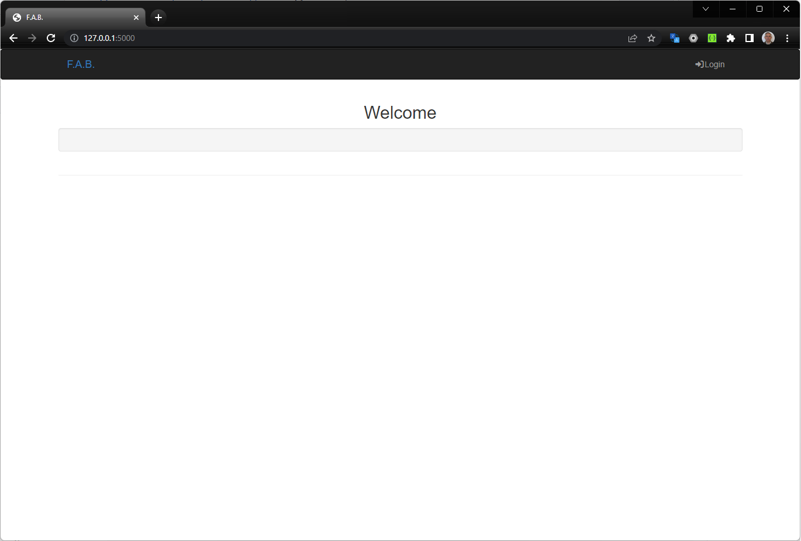
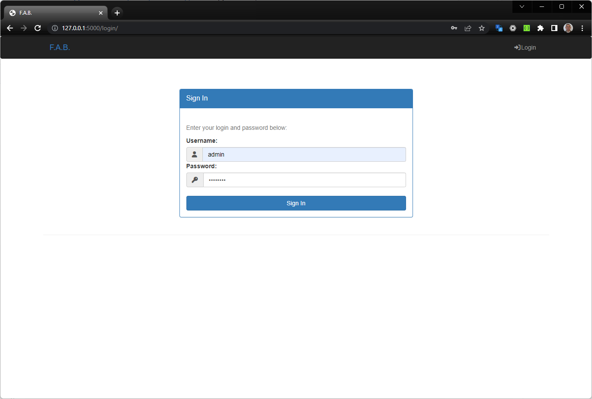
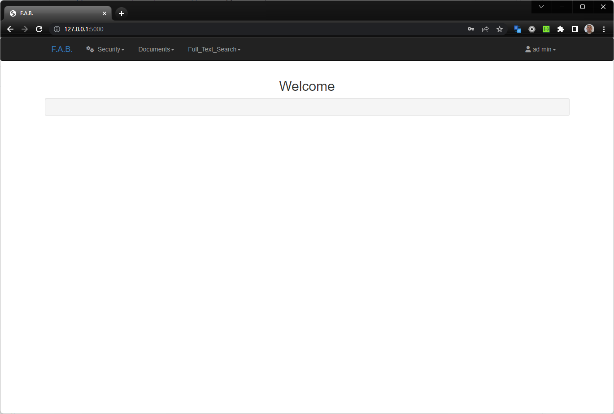
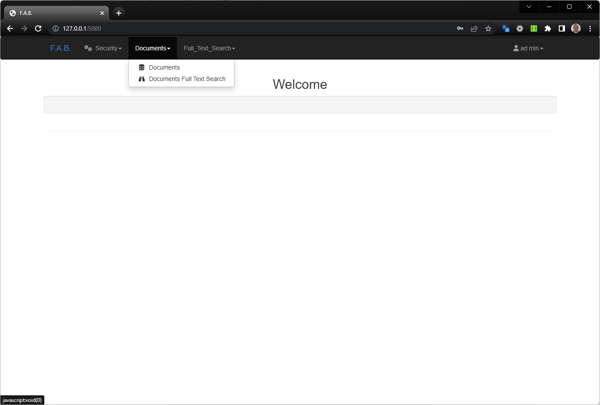
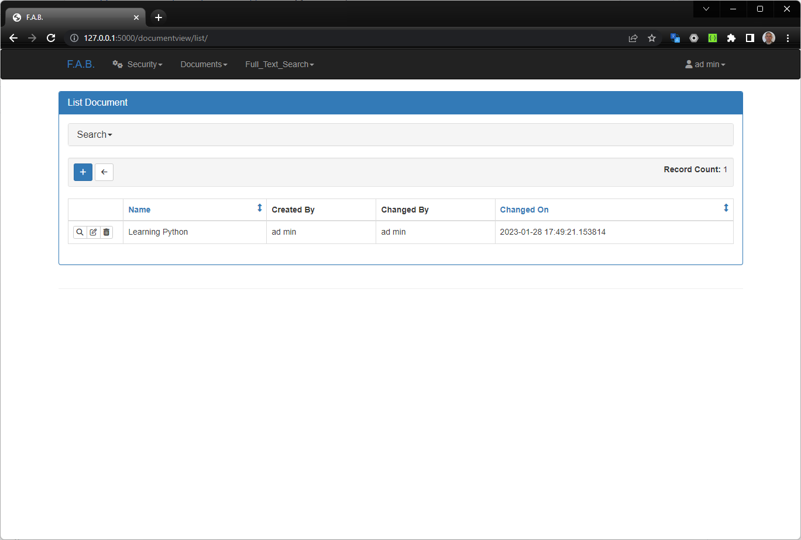
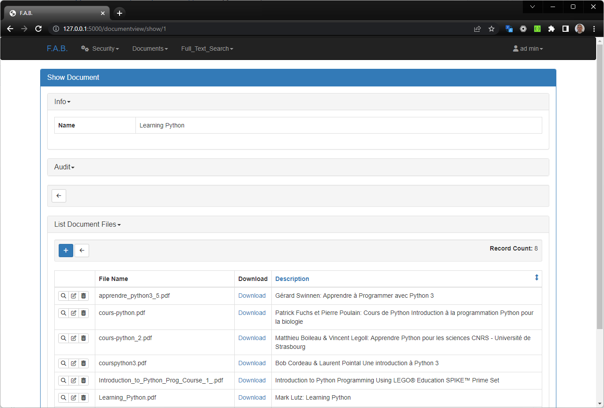
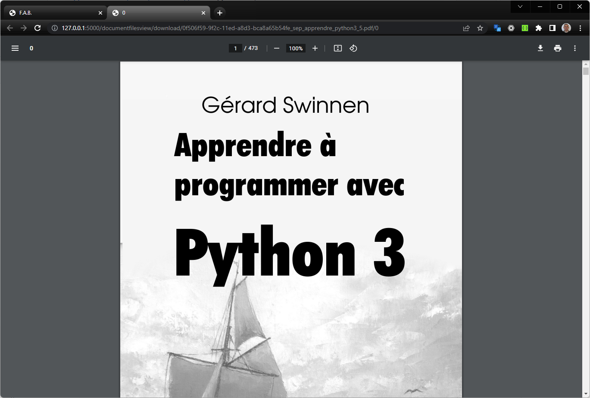
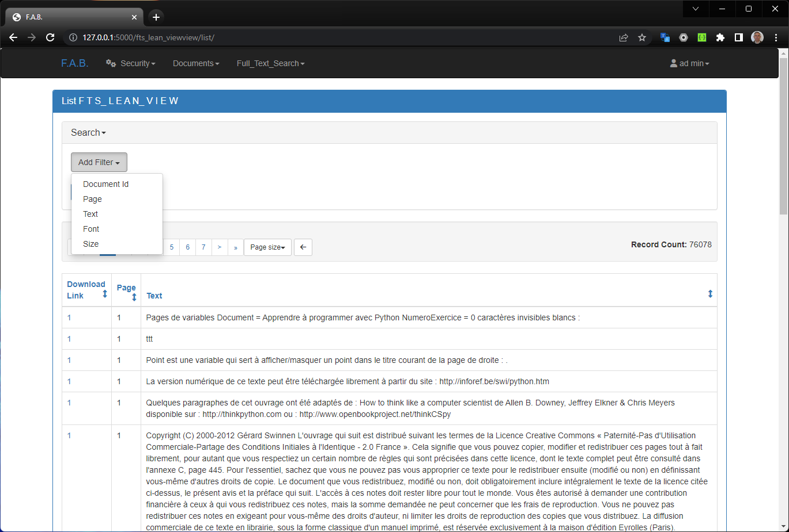
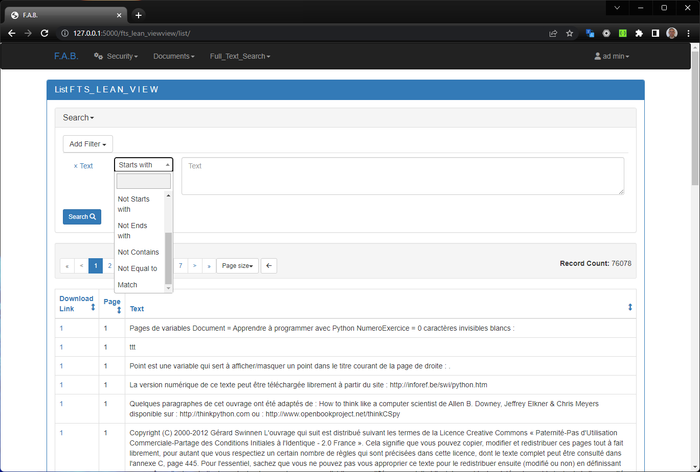
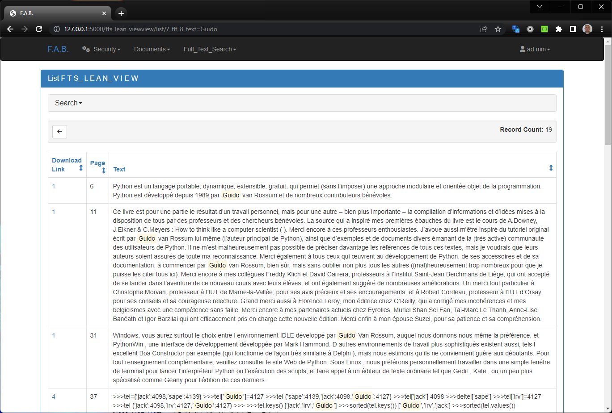

# FTSDOCUMENTS

## Description

**THIS IS A WORK IN PROGRESS**

This project is a mockup of a document library with full text search capabilities.
This project is complementing **Daniel Vaz Gaspar** example of flask-Appbuilder. You can find the original project [here](https://github.com/dpgaspar/Flask-AppBuilder/tree/master/examples/quickfiles).
The "project" concept being replaced by "Documents".

This app enables you to upload and manage documents. It is a simple app that can be used as a starting point for your own app.

I have added a few features to the original project:

- The original project enables to create "Projects" and within a "Project", you can upload/donwload documents.
- I have replaced the "Project" concept by "Documents". You can upload documents and manage them. This is a kind of Document Library.
- Document Files is the list of documents, including a description and a file. They are attached To a Document Library.
- The real new feature is that each time a document is uploaded in the library, a Full Text Search index is created.
- I have added a search view in the document library using the search box. The search is based on the Full Text Search index if you use the Match capability.
- The Match capability is added for Text and Strings columns. 
- I have also improved the rendering, has all the words in the match search request are highlighted in the document.
- A patched version of the flask-appbuilder is used to enable the Match capability.

## Performance

- Indexing a document takes about 1 second per page.
- Searching for a query is quite fast
- See the FTS5 SQLITE documentation for more information ref: https://www.sqlite.org/fts5.html.

## Patching

To do that, I have changed few things in the flask-appbuilder project. For this I have created a patch mechanism to overload the original code.
This overload needs to use the `package_patch.py` file. This script is used to patch the original flask-appbuilder package.

### How to use `package_patch.py`:

You need to do that only once. And again to get the latest version of the original package.

- Get to the parent directory of the patch_flask_appbuilder directory.
    - Makes sure the patch_flask_appbuilder.json is there.
    - Makes sure the patching files are there.
- have a copy of `python package_patch.py` in this parent directory.
- run `python package_patch.py --package flask_appbuilder`  to patch the flask_appbuilder package.
- the flask_appbuilder package is now patched and a subdirectory "flask_appbuilder" is created.

### How the patching mechanism works:

- The original package is installed in the venv "site-packages" directory with the `pip install -r requirements.txt` command.
- It firts creates a copy of the original package in the "flask_appbuilder" directory.
    - If the "flask_appbuilder" directory already exists, it is deleted.
- While doing this copy, using the flask_appbuilder.json file, for each file to be patched, it will:
    - rename the original file by prepending the "original_" prefix.
    - replace the original file by the patching file (which has the name of the original file).
- This way, the original code is not modified and the patching code is used instead.
- The whole `flask_appbuilder` in the venv directory is then completly shadowed.
- By shadowing the package, it is possible to overload the original code with the patching code.
- This enables to add new features to the original package without modifying the original code.
- Then we can update the original package without having to redo the patching.
- This is convinient as **Daniel Vaz Gaspar** cannot accept all the changes I have made to the original package.
- And it is still possible to use the latest version of `flask_appbuilder`.
- Of course, to use the latest version of the original package
    - The patching needs to be redone.
    - The patching files need to be reviewed to chack if they are still valid.
    - The patching files need to be updated if needed.
- The patching mechanism is not limited to the `flask_appbuilder` package.
- The patch_flask_appbuilder direcory contains:
    - the flask_appbuilder.json file which contains the list of files to be patched.
    - the patching files which are the files to be used to patch the original files.

## Installation

Have a look at the requirements.txt file to see the list of dependencies.

Outline to install the application.

- easiest is to use Visual Studio Code
- git clone this repository
- create a virtualenv
- install the dependencies
- patch the flask_appbuilder package
- use the "Python: Flask" option to run the app
- the login page should show up

## Usage

A default user is created (ad min): user: admin, password: password

- Input the credentials

- The main page should show up

- Click on the "Document" menu

- Click on the Documents menu

- Click on the "Show" button (a magnifying glass) to see the document library

- Should you click on a download link, you will view the document as a new tab in the browser

- You can also search for a document using the search box (Documents Full Text Search) menu

- Choose the "Match" option and enter the text to search for and click on search

- The result should show up

As you can see, the search words are highlighted in the result screen.

## Credits

- **Daniel Vaz Gaspar** flask-Appbuilder

## License

MIT License

Copyright <2023> <COPYRIGHT Gilbert BRAULT>

Permission is hereby granted, free of charge, to any person obtaining a copy of this software and associated documentation files (the "Software"), to deal in the Software without restriction, including without limitation the rights to use, copy, modify, merge, publish, distribute, sublicense, and/or sell copies of the Software, and to permit persons to whom the Software is furnished to do so, subject to the following conditions:

The above copyright notice and this permission notice shall be included in all copies or substantial portions of the Software.

THE SOFTWARE IS PROVIDED "AS IS", WITHOUT WARRANTY OF ANY KIND, EXPRESS OR IMPLIED, INCLUDING BUT NOT LIMITED TO THE WARRANTIES OF MERCHANTABILITY, FITNESS FOR A PARTICULAR PURPOSE AND NONINFRINGEMENT. IN NO EVENT SHALL THE AUTHORS OR COPYRIGHT HOLDERS BE LIABLE FOR ANY CLAIM, DAMAGES OR OTHER LIABILITY, WHETHER IN AN ACTION OF CONTRACT, TORT OR OTHERWISE, ARISING FROM, OUT OF OR IN CONNECTION WITH THE SOFTWARE OR THE USE OR OTHER DEALINGS IN THE SOFTWARE.

## Changelog

- 2021-02-03: Initial version
- 2021-02-15: Optimized the indexing, added asynchronous feedback, dropped FTS5.

## Some software:

https://soft.rubypdf.com/software/pdf2htmlex-windows-version

